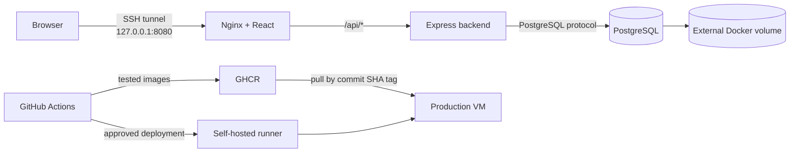

# Company Ticket Lab

[](https://github.com/Rafattitas/company-ticket-lab/actions/workflows/pipeline.yml)

A production-style Docker and DevOps training project for a small support-ticket application. The repository demonstrates application containerization, network isolation, persistent PostgreSQL storage, CI security gates, GHCR image publishing, and an approval-controlled deployment to an Ubuntu Server VM.

> This is a training environment. It demonstrates production practices, but it is not an approved production platform.

## Architecture



- Nginx serves the compiled React application and proxies `/api/` requests to the backend.
- The backend and PostgreSQL communicate on an internal Docker network.
- PostgreSQL is not published to the host.
- The frontend is published only on the VM loopback address, `127.0.0.1:8080`.
- Users reach the application through an SSH local port-forward.

See [Architecture](docs/architecture.md) for the request flow, network boundaries, and persistent state.

## Repository tree

```text
company-ticket-lab/
├── .github/
│   ├── actionlint.yaml
│   └── workflows/
│       └── pipeline.yml
├── backend/
│   ├── migrations/
│   │   └── 001_create_tickets.sql
│   ├── routes/
│   │   └── tickets.js
│   ├── test/
│   │   └── tickets.test.js
│   ├── Dockerfile
│   ├── db.js
│   └── server.js
├── deploy/
│   ├── postgres/
│   │   └── Dockerfile
│   ├── compose.yaml
│   ├── images.env.example
│   ├── integration-test.sh
│   ├── production-deploy.sh
│   ├── publish-images.sh
│   └── scan-images.sh
├── docs/
│   ├── architecture.md
│   ├── deployment.md
│   ├── operations-runbook.md
│   └── security-scanning.md
├── frontend/
│   ├── public/
│   ├── src/
│   ├── Dockerfile
│   ├── nginx.conf
│   └── package.json
├── .gitattributes
├── .gitignore
├── CONTRIBUTING.md
└── README.md
```

Generated directories such as `node_modules/` and `frontend/dist/` are intentionally excluded from Git.

## Components

| Component | Technology | Responsibility |
|---|---|---|
| Frontend | React, Vite, unprivileged Nginx | Serves the UI and reverse-proxies API requests |
| Backend | Node.js, Express, `pg` | Validates requests and provides the ticket API |
| Database | PostgreSQL 17 | Stores ticket data in an external volume |
| Orchestration | Docker Compose | Defines services, networks, secrets, limits, and health checks |
| Registry | GitHub Container Registry | Stores tested backend, frontend, and PostgreSQL images |
| Automation | GitHub Actions | Tests, builds, scans, publishes, and deploys releases |

## API

| Method | Path | Purpose |
|---|---|---|
| `GET` | `/health/live` | Process liveness |
| `GET` | `/health/ready` | Backend and database readiness |
| `GET` | `/api/tickets` | List the latest tickets |
| `GET` | `/api/tickets/:id` | Read one ticket |
| `POST` | `/api/tickets` | Create a ticket |
| `PATCH` | `/api/tickets/:id/status` | Update a ticket status |

Allowed ticket states are `open`, `in_progress`, `resolved`, and `closed`.

## CI/CD pipeline

Pull requests run the verification stage only. A push to `main` runs the complete pipeline:

```text
verify
  ├── backend unit tests
  ├── frontend lint and build
  ├── container image builds
  ├── temporary PostgreSQL integration test
  └── Trivy vulnerability gate
        ↓
publish
  └── push the tested images to GHCR with sha-<commit> tags
        ↓
production approval
        ↓
deploy
  └── backup, pull, Compose update, health check, and rollback on failure
```

The production job runs on the `lab-prod` self-hosted runner and is protected by the GitHub `production` environment. Database passwords remain on the VM and are never stored in GitHub.

See [Deployment](docs/deployment.md) for the complete release flow and host layout.

## Security controls

- Base images and GitHub Actions are pinned to immutable digests or commit SHAs.
- Backend and frontend containers use read-only filesystems and drop all Linux capabilities.
- Privilege escalation is disabled with `no-new-privileges`.
- PostgreSQL and the backend are not published to the LAN.
- Secrets are stored under `/etc/company-ticket/secrets/`, outside Git.
- The deployment runner can invoke one root-owned deployment command only.
- Trivy reports HIGH and CRITICAL findings and blocks the configured fixable findings.
- A logical database backup is created and validated before every deployment.
- The deployment host retains the latest ten local backup sets.

See [Security scanning](docs/security-scanning.md) for the current Trivy gate and its documented exception.

## Operations

Common checks, logs, runner diagnostics, disk checks, and deployment troubleshooting are documented in the [Operations runbook](docs/operations-runbook.md).

## Development workflow

Changes are made on short-lived branches and merged through pull requests after the verification job succeeds. See [Contributing](CONTRIBUTING.md) for branch names, checks, commit guidance, and the rule against committing secrets.

## Current limitations

- Backups are stored locally on the VM; loss of the VM or its disk can remove both live data and backups.
- The lab uses one VM and one self-hosted deployment runner.
- Image tags include the Git commit SHA for traceability but remain registry tags; digest-based deployment would provide stronger immutability.
- The documented PostgreSQL `gosu` finding still requires a separate reachability review.
