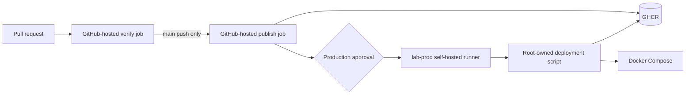

# Architecture

## Runtime topology

```mermaid
flowchart TB
    subgraph Client[Management workstation]
        Browser[Web browser]
        Tunnel[SSH local port forward]
    end

    subgraph VM[Ubuntu Server VM]
        Loopback[127.0.0.1:8080]

        subgraph Edge[Docker edge network]
            Frontend[Nginx + React<br/>frontend:8080]
        end

        subgraph Internal[External internal Docker network]
            Backend[Express API<br/>backend:3000]
            Database[(PostgreSQL<br/>postgres:5432)]
        end

        Volume[(company-ticket-postgres-data)]
        Secrets[/etc/company-ticket/secrets]
    end

    Browser --> Tunnel --> Loopback --> Frontend
    Frontend -->|/api/*| Backend
    Backend --> Database
    Database --> Volume
    Secrets -. read-only mounts .-> Backend
    Secrets -. read-only mounts .-> Database
```

## Request flow

### Static application request

1. The browser opens `http://127.0.0.1:8080` on the management workstation.
2. The SSH tunnel carries the connection to `127.0.0.1:8080` on the VM.
3. Docker forwards the request to the frontend container.
4. Nginx returns the compiled React files from `/usr/share/nginx/html`.

### API request

1. React sends a same-origin request such as `GET /api/tickets`.
2. Nginx matches `/api/` and proxies the request to `http://backend:3000`.
3. The backend resolves the Compose service name `postgres` on the internal network.
4. PostgreSQL reads or updates the external data volume.
5. The JSON response returns through the backend, Nginx, SSH tunnel, and browser.

The browser never connects directly to the backend or PostgreSQL.

## Network boundaries

| Network or interface | Members | Purpose |
|---|---|---|
| VM loopback | Frontend published port | Limits application access to the VM itself and SSH tunnels |
| `edge` | Frontend | Provides the published frontend endpoint |
| `company-ticket-internal` | Frontend, backend, PostgreSQL | Private service-to-service communication |
| VM LAN interface | SSH only from the management address | Administrative access |

`company-ticket-internal` is created outside Compose and referenced as an external network. Compose therefore reuses the same controlled network instead of creating a replacement during every project lifecycle operation.

## Persistent and ephemeral state

| Data | Location | Lifecycle |
|---|---|---|
| PostgreSQL data | External Docker volume `company-ticket-postgres-data` | Survives container replacement and `docker compose down` |
| Database backups | `/var/backups/company-ticket` | Latest ten deployment backup sets are retained |
| Database passwords | `/etc/company-ticket/secrets` | Host-managed and excluded from Git |
| Selected image references | `/etc/company-ticket/images.env` | Updated atomically by the deployment script |
| Container temporary files | `/tmp` tmpfs | Removed with the container |
| Application source in containers | Image layers | Read-only at runtime |

The external volume provides persistence, not historical recovery. Logical `pg_dump` backups provide restore points before deployments.

## Container security posture

- The backend runs as the unprivileged `node` user.
- The frontend uses the unprivileged Nginx image and listens on port `8080`.
- Backend and frontend root filesystems are read-only.
- All Linux capabilities are dropped from backend and frontend containers.
- `no-new-privileges` blocks privilege escalation.
- Resource and PID limits reduce the impact of runaway processes.
- PostgreSQL and backend ports are exposed only to Docker networks.

## Delivery topology



The self-hosted runner does not receive direct Docker or unrestricted sudo access. It can invoke only `/usr/local/sbin/company-ticket-deploy`, which validates a full commit SHA and accepts releases reachable from `origin/main`.
